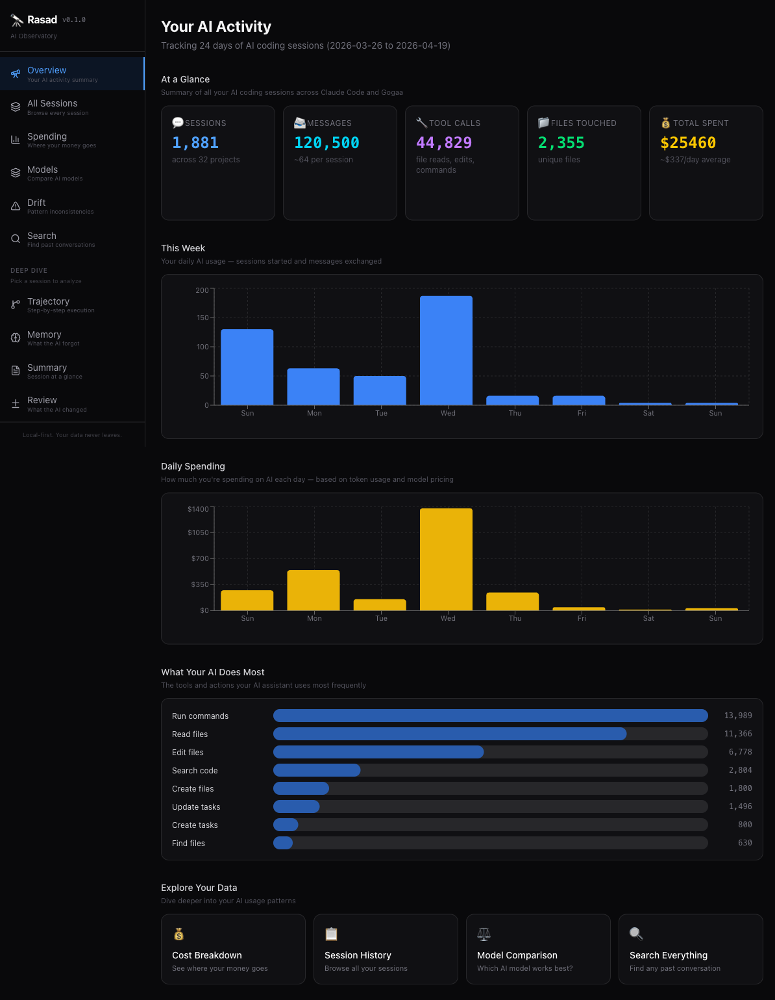
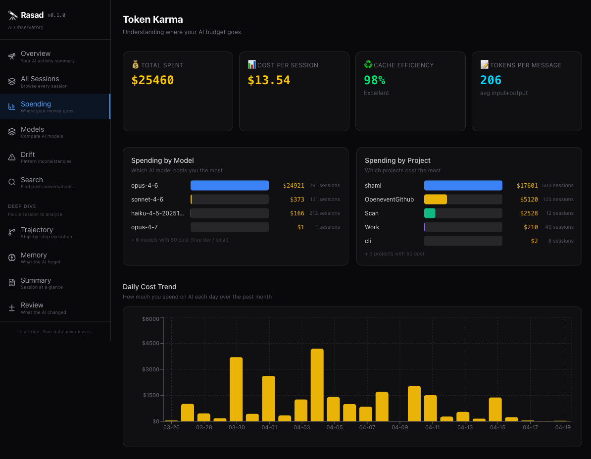
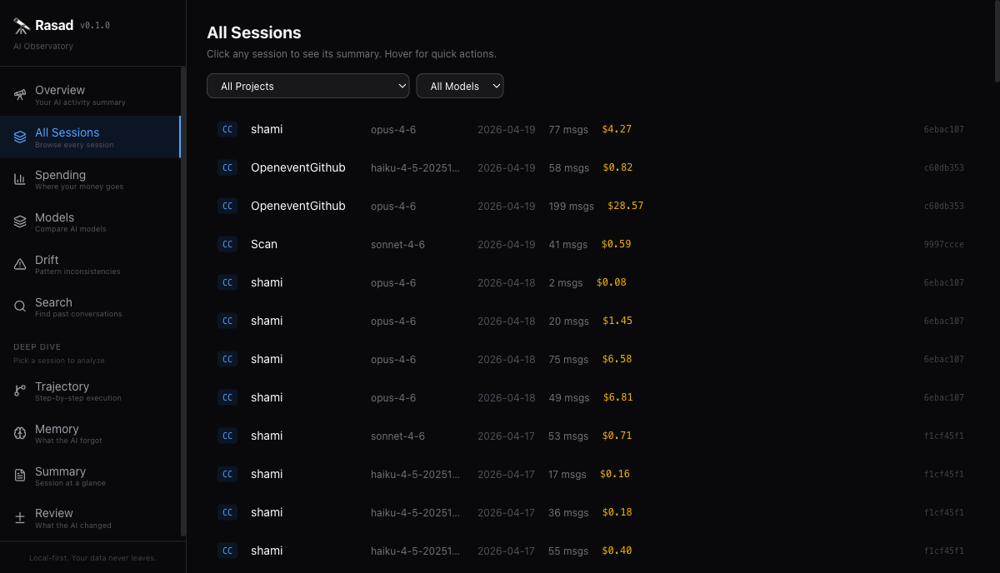

# Rasad (رصد) — AI Observatory for Developers

[](https://www.npmjs.com/package/rasad-ai)
[](https://opensource.org/licenses/MIT)
[](https://nodejs.org)

> Monitor what your AI coding assistant is actually doing. Costs, context, tool calls, drift, and more.

**Your data never leaves your machine.** Zero outbound network requests. Local SQLite. No telemetry.



## The Problem

AI coding assistants (Claude Code, Gogaa, Cursor, Copilot) run dozens of tool calls per session, burn through tokens, and make decisions you never see. There is no way to know:

- Where your money is going
- Whether the AI forgot your requirements mid-conversation
- What files it actually changed and why
- If it's contradicting patterns from earlier sessions

**Rasad answers all of these.** It's the first open-source AI session observatory on npm.

## Quick Start

```bash
npx rasad-ai
```

That's it. Rasad auto-detects your Claude Code sessions at `~/.claude/projects/` and syncs immediately.

```bash
# Or install globally
npm install -g rasad-ai
rasad dashboard    # Web dashboard on localhost:9847
rasad watch        # Live TUI in your terminal
```

## What You Get

### Web Dashboard (15 pages)

| Feature | What It Answers |
|---|---|
| **Token Karma** | Where is my money going? Which model costs the most? |
| **Ghost Context** | Did the AI forget my requirements mid-conversation? |
| **Trajectory** | Step-by-step execution tree. Every tool call visualized. |
| **Session Passport** | Quick summary: files changed, decisions made, key moments |
| **Drift Detector** | Is the AI contradicting patterns from earlier sessions? |
| **Vibe Diff** | Reviewable artifact of what the AI changed |
| **Model Compare** | Which model gives the best value? Head-to-head. |
| **Search** | Find any past conversation across all sessions |





### Terminal TUI (`rasad watch`)

Full-screen interactive terminal UI with:
- Live session feed as your AI works
- Phase detection (planning / exploring / executing / verifying / refining)
- Real-time cost tracking per session
- Tool call breakdown with outcomes
- Smart coaching tips based on session patterns

### X-Ray Mode

Real-time action viewer showing exactly what your AI is doing right now:
- Every tool call with arguments and outcomes
- File diffs as they happen
- Context window utilization
- Available across TUI, dashboard, and API

### CLI Commands

Every feature is available in both the web dashboard and the CLI:

```bash
rasad                    # Quick summary of your AI activity
rasad dashboard          # Open the web dashboard (localhost:9847)
rasad watch              # Live TUI — full-screen terminal dashboard
rasad sync               # Re-sync latest sessions
rasad karma              # Cost breakdown in your terminal
rasad timeline           # List recent sessions
rasad trajectory <id>    # Step-by-step execution tree
rasad context <id>       # Ghost Context — what the AI forgot
rasad passport <id>      # Session summary (--md to export Markdown)
rasad vibe-diff <id>     # What the AI changed (--md to export)
rasad drift              # Find pattern inconsistencies
rasad compare            # Head-to-head model comparison
rasad search <query>     # Full-text search across all conversations
```

#### Examples

```bash
# How much am I spending?
$ rasad karma
  Total cost:     $25,460
  Avg/session:    $13.54
  Cache hit rate: 98.0%

# What happened in this session?
$ rasad passport 6ebac107
  Project:    shami
  Duration:   2h 4m
  Cost:       $39.32
  Tool calls: 108
  Files:      28

# Export a session as Markdown
$ rasad passport 6ebac107 --md
  Exported to passport-6ebac107.md
```

## Data Sources

| Source | Path | Status |
|---|---|---|
| **Claude Code** | `~/.claude/projects/**/*.jsonl` | Supported |
| **Gogaa CLI** | `~/.gogaa/sessions/*.json` | Supported |
| **Aider** | `~/.aider/sessions/*.jsonl` | Supported |
| Cursor | SQLite DB | Planned |
| Copilot | — | Planned |

## How It Works

1. **Sync** — Reads AI session files (JSONL/JSON) and parses every message, tool call, and token count
2. **Store** — Local SQLite database at `~/.rasad/rasad.db` with full-text search (FTS5)
3. **Analyze** — 8 analysis engines compute costs, context usage, drift patterns, and session summaries
4. **Visualize** — Web dashboard on localhost or CLI output or full-screen TUI
5. **Live** — File watcher auto-syncs new sessions in real-time via WebSocket

### Performance

- First sync: ~18 seconds for 1,900 sessions (700MB+ of data)
- Incremental sync: <1 second (only processes new/changed files)
- Dashboard: instant — all queries hit local SQLite

## Privacy and Security

- **Zero outbound network requests** — the binary cannot phone home
- **All data stays at `~/.rasad/`** — local SQLite database
- **No telemetry, no tracking, no cloud**
- **Server binds to 127.0.0.1 only** — no network exposure

## Tech Stack

- **Runtime**: TypeScript + Node.js (ESM)
- **Database**: SQLite via better-sqlite3 (WAL mode, FTS5 full-text search)
- **CLI**: Commander
- **TUI**: React Ink (full-screen interactive terminal)
- **Server**: Fastify (localhost only)
- **Dashboard**: React + Tailwind CSS + Recharts
- **Build**: esbuild (CLI) + Vite (dashboard)
- **Live updates**: WebSocket (auto-refresh on new sessions)
- **Tests**: Vitest (63 tests)

## Development

```bash
git clone https://github.com/shami-ah/rasad.git
cd rasad
npm install
cd dashboard && npm install && cd ..

npm run build            # Build everything
npm run dev              # Watch CLI changes
npm run dev:dashboard    # Vite dev server for dashboard
npm test                 # Run tests
npm run typecheck        # Type check
```

## Roadmap

- [x] Claude Code adapter
- [x] Gogaa CLI adapter
- [x] Aider adapter
- [x] Web dashboard (15 pages)
- [x] Full-screen TUI (`rasad watch`)
- [x] X-Ray mode (real-time action viewer)
- [x] 10+ CLI commands
- [x] Full-text search (FTS5)
- [x] Live sync (file watcher + WebSocket)
- [x] CAMEL-aligned phase detection
- [x] Proactive alerts and anomaly detection
- [x] Markdown export
- [ ] Cursor adapter (SQLite DB parsing)
- [ ] Copilot adapter
- [ ] Browser extension (ChatGPT, Claude.ai)
- [ ] AI-powered session summaries
- [ ] Team sharing and multi-developer dashboards

## License

MIT

## Author

**Engr Ahtesham Ahmad** — [GitHub](https://github.com/shami-ah) | [Portfolio](https://ahtesham.dev.wadwarehouse.com)
